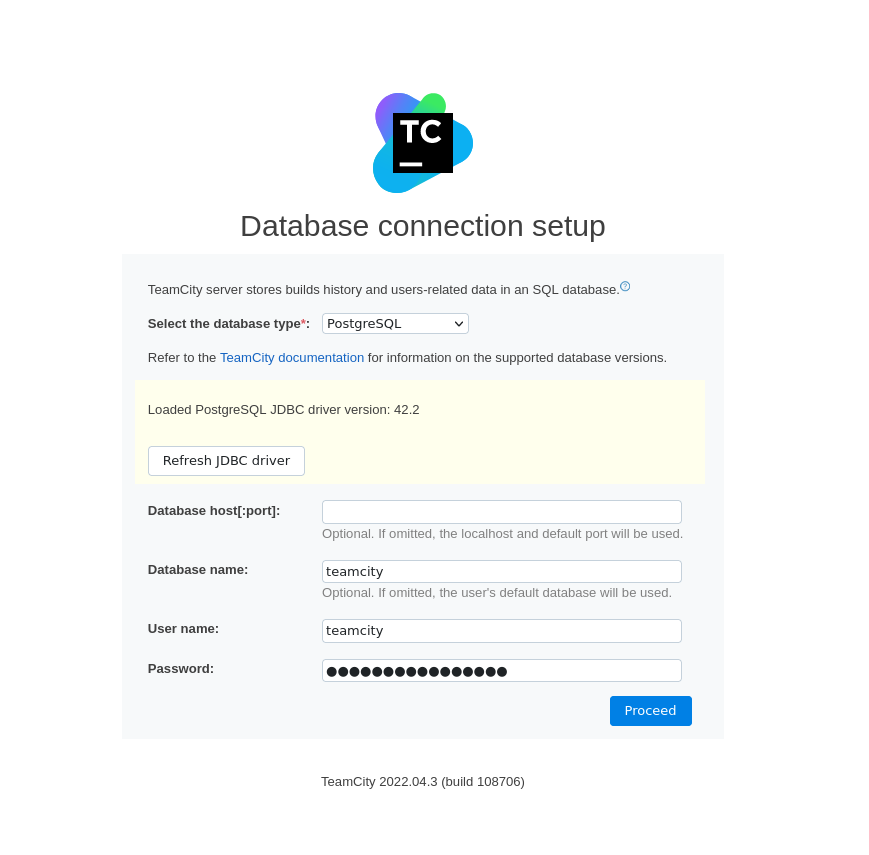

# TeamCityServer
TeamCityServer is a project for creating a dockerized Teamcity server, agents, and external database. Speeding up and reducing the complexity of having CI/CD for the home user.

This project is in it's early stages of development. So far, it has only been tested and used on a local linux machine.

## Connect to Postgres
### Setting the Database host[:port] value
<br />
<br/>
<mark>Download the drivers after selecting the PostgreSQL from the drop-down menu.</mark>
<br/>
To retrieve the database host[:port] value, run the following command:
```bash
docker service ls
```
Insert the ID of the local-teamcity_postgres service into the command:
```bash
docker inspect <local-teamcity_postgres-Service-ID> | grep -i "addr"
```
The output should look similar to the following:
```bash
"Addr": "10.0.0.232/24"
"Addr": "10.0.3.7/24" <--- This is the database host[:port] value
```
If you are using the default port 5432:5432 for postgres in the teamcity_configs the value will be <ins>10.0.3.7:5432</ins>

